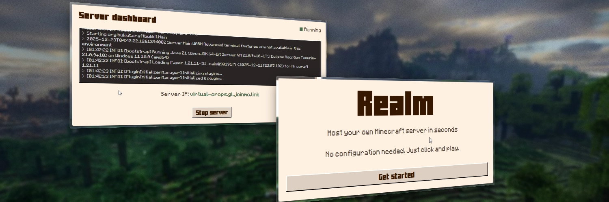

# Realm

**The easiest way to host your own Minecraft server.**

Realm is a local-first, zero-config Minecraft server launcher designed for non-technical users. It automates the entire process of setting up a Java Edition server, managing dependencies, and exposing it to the internet using [playit.gg](https://playit.gg), no port forwarding required.
## ✨ Features

- **One Happy Path:** A streamlined experience with zero unnecessary configuration.
- **Automated Setup:** Automatically downloads and configures Java, the Minecraft Server JAR, and the Playit tunnel.
- **No Port Forwarding:** Built-in tunneling exposes your server securely without touching router settings.
- **Local-First:** You own your data. No external accounts or backend services required (except for the tunnel).
- **Visible State:** Clear, real-time feedback on what the server is doing.

## 🛠️ Tech Stack

- **Frontend:** [React](https://react.dev/), [TypeScript](https://www.typescriptlang.org/), [Tailwind CSS](https://tailwindcss.com/)
- **Backend:** [Rust](https://www.rust-lang.org/) (Tauri)
- **Framework:** [Tauri v2](https://tauri.app/)

## 🚀 Development

### Prerequisites

- [Rust](https://www.rust-lang.org/tools/install)
- [Node.js](https://nodejs.org/) or [Bun](https://bun.sh/)

### Setup

1. Clone the repository.
2. Install frontend dependencies:
   ```bash
   bun install
   ```

### Running Locally

Start the development server:

```bash
bun tauri dev
```
